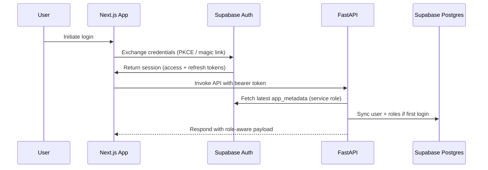

# Backend Architecture

## Service Architecture
### Serverless Architecture
Not applicable; CPU-intensive simulations and compliance workflows favor containerized services with predictable runtime.

### Traditional Server Architecture
#### Controller/Route Organization
```text
apps/api/src/
├── main.py
├── api/
│   ├── dependencies.py
│   ├── routers/
│   │   ├── strategies.py
│   │   ├── strategy_versions.py
│   │   ├── backtests.py
│   │   ├── paper_trades.py
│   │   ├── templates.py
│   │   ├── notifications.py
│   │   ├── plan_usage.py
│   │   └── admin/compliance.py
├── services/
├── repositories/
├── workers/
└── settings.py
```

#### Controller Template
```python
from fastapi import APIRouter, Depends, status
from typing import List
from app.schemas.strategy import StrategyCreate, StrategyResponse
from app.services.strategy_service import StrategyService
from app.dependencies import get_current_user

router = APIRouter(prefix='/strategies', tags=['strategies'])

@router.get('', response_model=List[StrategyResponse])
async def list_strategies(service: StrategyService = Depends()):
    return await service.list_strategies()

@router.post('', response_model=StrategyResponse, status_code=status.HTTP_201_CREATED)
async def create_strategy(payload: StrategyCreate,
                          user=Depends(get_current_user),
                          service: StrategyService = Depends()):
    return await service.create_strategy(user=user, payload=payload)
```

## Database Architecture
### Schema Design
See SQL DDL above. Migrations managed with Alembic, and Supabase Timescale extension retention policies compress raw metrics after 90 days while rolling up aggregates for dashboards.

### Data Access Layer
```python
from sqlalchemy.ext.asyncio import AsyncSession
from sqlalchemy import select
from app.models.strategy import StrategyModel
from app.schemas.strategy import StrategyResponse

class StrategyRepository:
    def __init__(self, session: AsyncSession):
        self.session = session

    async def list(self, owner_id: str | None = None) -> list[StrategyResponse]:
        stmt = select(StrategyModel).order_by(StrategyModel.created_at.desc())
        if owner_id:
            stmt = stmt.where(StrategyModel.owner_id == owner_id)
        result = await self.session.execute(stmt)
        return [StrategyResponse.model_validate(row) for row in result.scalars()]
```

## Quota Enforcement Service
```python
from datetime import datetime, timezone
from app.repositories.plan_usage_repository import PlanUsageRepository
from app.schemas.errors import QuotaExceededError

class PlanUsageService:
    def __init__(self, repo: PlanUsageRepository):
        self.repo = repo

    async def assert_within_quota(self, user_id: str, metric: str) -> None:
        usage = await self.repo.get_active_window(user_id=user_id, metric=metric)
        if usage.used >= usage.limit:
            raise QuotaExceededError(metric=metric, limit=usage.limit)
        await self.repo.increment(user_id=user_id, metric=metric, at=datetime.now(timezone.utc))
```

## Authentication and Authorization
### Auth Flow


### Middleware/Guards
```python
from fastapi import Depends, HTTPException, status
from fastapi.security import HTTPBearer
from jose import jwt
from app.settings import settings
from app.repositories.user_repository import UserRepository

auth_scheme = HTTPBearer(auto_error=False)

async def get_current_user(token=Depends(auth_scheme), repo: UserRepository = Depends()):
    if token is None:
        raise HTTPException(status_code=status.HTTP_401_UNAUTHORIZED, detail='Missing bearer token')
    try:
        payload = jwt.decode(
            token.credentials,
            settings.supabase_jwt_secret,
            algorithms=['HS256'],
            audience=settings.supabase_api_audience,
        )
    except jwt.JWTError as exc:
        raise HTTPException(status_code=status.HTTP_401_UNAUTHORIZED, detail='Invalid token') from exc
    return await repo.get_or_create_from_claims(payload)
```
