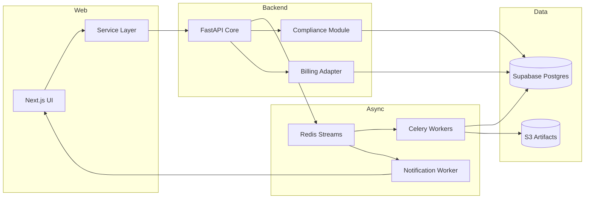

# Components

## Next.js Experience Layer
**Responsibility:** Implements onboarding, canvas editing, dashboards, notifications per UI spec.

**Key Interfaces:**
- REST client generated from OpenAPI
- Server-sent events for backtest progress
- Supabase auth helpers for session/token management

**Dependencies:** Supabase Auth service, Strategy API, Notification API

**Technology Stack:** Next.js 15, React 18, Tailwind, React Query, Zustand

## FastAPI Core Service
**Responsibility:** Exposes CRUD, enforces quotas, orchestrates jobs, handles compliance/billing webhooks.

**Key Interfaces:**
- `/api/v1` REST endpoints
- Redis Streams and EventBridge for async orchestration
- Stripe webhooks and Supabase service role callbacks

**Dependencies:** Supabase Postgres, Redis, S3, Stripe

**Technology Stack:** FastAPI, SQLAlchemy, Pydantic, Celery producers

## Simulation Worker Fleet
**Responsibility:** Executes backtests, calculates KPIs, generates trade logs, publishes anomalies.

**Key Interfaces:**
- Consumes `simulation.run` stream
- Writes metrics to Supabase Postgres (Timescale extension), artifacts to S3
- Emits events to Notification service

**Dependencies:** Institutional market data API, Supabase Postgres, Redis

**Technology Stack:** Python, Celery, Pandas, NumPy, vectorbt, TA-Lib

## Paper Trading Scheduler
**Responsibility:** Maintains recurring paper trades, monitors alert thresholds, feeds dashboards.

**Key Interfaces:**
- EventBridge schedules -> Redis Streams
- REST callbacks for anomaly escalation
- Notification service integration

**Dependencies:** Simulation worker, Supabase Postgres, Notification service

**Technology Stack:** Celery beat, FastAPI background tasks, Redis

## Notification Service
**Responsibility:** Normalizes notifications into email, in-app, and webhooks with delivery tracking.

**Key Interfaces:**
- Consumes `notify.event` stream
- SES/Postmark email, WebSocket gateway for in-app center
- Writes Notification records to Supabase Postgres

**Dependencies:** FastAPI core, Redis, SES/Postmark, Supabase profiles

**Technology Stack:** FastAPI, Celery worker, Jinja templating

## Compliance & Governance Module
**Responsibility:** Manages disclosures, risk reviews, takedown workflows, exports audit packages.

**Key Interfaces:**
- Admin REST endpoints `/api/v1/admin/compliance/*`
- S3 evidence archive
- Notification hooks for reviewer tasks

**Dependencies:** Supabase Postgres (role metadata), Notification service

**Technology Stack:** FastAPI, SQLAlchemy, Prefect for longer audits

## Component Diagram

