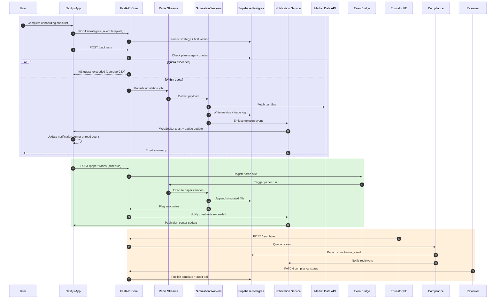

# Core Workflows

```mermaid
sequenceDiagram
  autonumber
  participant U as User
  participant FE as Next.js App
  participant API as FastAPI Core
  participant Q as Redis Streams
  participant W as Simulation Workers
  participant DB as Supabase Postgres
  participant N as Notification Service
  participant MD as Market Data API
  rect rgb(230,230,250)
    U->>FE: Complete onboarding checklist
    FE->>API: POST /strategies (select template)
    API->>DB: Persist strategy + first version
    FE->>API: POST /backtests
    API->>DB: Check plan usage + quotas
    alt Quota exceeded
      API-->>FE: 403 quota_exceeded (upgrade CTA)
    else Within quota
      API->>Q: Publish simulation job
      Q->>W: Deliver payload
      W->>MD: Fetch candles
      W->>DB: Write metrics + trade log
      W->>N: Emit completion event
      N->>FE: WebSocket toast + badge update
      FE->>FE: Update notification center unread count
      N->>U: Email summary
    end
  end
  rect rgb(220,245,220)
    FE->>API: POST /paper-trades (schedule)
    API->>EventBridge: Register cron rule
    EventBridge->>Q: Trigger paper run
    Q->>W: Execute paper iteration
    W->>DB: Append simulated fills
    W->>API: Flag anomalies
    API->>N: Notify thresholds exceeded
    N->>FE: Push alert center update
  end
  rect rgb(255,240,220)
    Educator FE->>API: POST /templates
    API->>Compliance: Queue review
    Compliance->>DB: Record compliance_event
    Compliance->>N: Notify reviewers
    Reviewer->>API: PATCH compliance status
    API->>DB: Publish template + audit trail
  end
```
