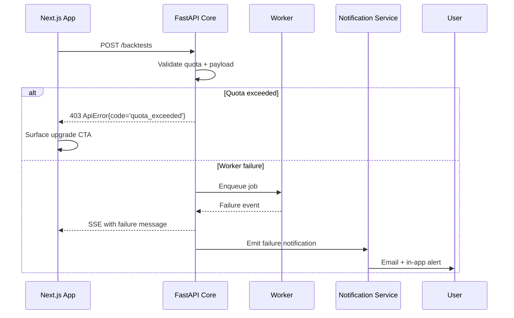

# Error Handling Strategy

## Error Flow


## Error Response Format
```typescript
interface ApiError {
  error: {
    code: string;
    message: string;
    details?: Record<string, any>;
    timestamp: string;
    requestId: string;
  };
}
```

## Frontend Error Handling
```typescript
export class ApiError extends Error {
  public readonly code: string;
  public readonly details?: Record<string, unknown>;

  private constructor(code: string, message: string, details?: Record<string, unknown>) {
    super(message);
    this.code = code;
    this.details = details;
  }

  static fromResponse(payload: ApiError, status: number) {
    const { code, message, details } = payload.error;
    return new ApiError(code, message, { ...details, status });
  }
}

export function interpretError(error: unknown): { title: string; description: string } {
  if (error instanceof ApiError) {
    switch (error.code) {
      case 'quota_exceeded':
        return { title: 'Quota reached', description: 'Upgrade to unlock more backtests today.' };
      case 'validation_failed':
        return { title: 'Validation failed', description: 'Fix highlighted blocks and retry.' };
      default:
        return { title: 'Unexpected error', description: error.message };
    }
  }
  return { title: 'Network error', description: 'Check your connection and try again.' };
}
```

## Backend Error Handling
```python
from fastapi import Request, status
from fastapi.responses import JSONResponse
from app.core.logging import logger
from app.core.errors import DomainError

async def domain_error_handler(request: Request, exc: DomainError) -> JSONResponse:
    logger.warning(
        'domain_error',
        extra={
            'code': exc.code,
            'details': exc.details,
            'request_id': request.state.request_id,
        },
    )
    return JSONResponse(
        status_code=exc.status_code or status.HTTP_400_BAD_REQUEST,
        content={
            'error': {
                'code': exc.code,
                'message': exc.message,
                'details': exc.details,
                'timestamp': request.state.timestamp.isoformat(),
                'requestId': request.state.request_id,
            }
        },
    )
```
