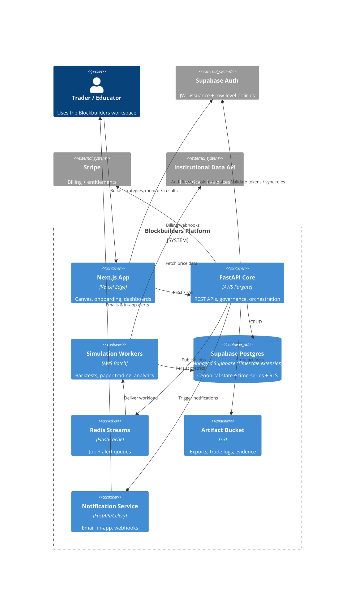

# High Level Architecture

## Technical Summary
Blockbuilders adopts a composable hybrid: the user experience is delivered by Next.js 15 on Vercel Edge, while a containerized FastAPI core on AWS Fargate exposes REST APIs, orchestrates simulations, and enforces compliance. Long-running backtests and paper-trading loops execute asynchronously through Celery workers on AWS Batch backed by Redis Streams and Supabase Postgres hypertables (Timescale extension). Supabase supplies managed Postgres, row-level security, and JWT-based auth that both frontend guards (Zustand + middleware) and backend policy checks consume. Object storage in S3 retains strategy exports, audit packages, and simulation artifacts (with Supabase Storage handling avatars and lightweight uploads), and Datadog/Sentry instrumentation spans every component so anomalies surface within the five-minute NFR window. Plan guardrails surface consistently across tiers through shared quota services, while the notification center, compliance disclosures, and mobile read-only dashboards consume the same APIs to honor the refreshed UX specification. This architecture keeps first-win onboarding fast, makes results trustworthy, and scales into community sharing without sacrificing governance or accessibility.

## Platform and Infrastructure Choice
**Option A – Vercel + Supabase + AWS workers (recommended):** Keeps Next.js on Vercel Edge while delegating auth, managed Postgres (Timescale + pgvector extensions), and lightweight storage to Supabase. AWS Fargate/Batch continue powering FastAPI and simulation workloads with minimal infrastructure drift.
**Option B – Fully AWS-managed stack:** Replace Supabase with Aurora PostgreSQL and Cognito. Reduces third-party dependencies but requires heavier IAM authoring and custom policy enforcement before we can ship.
**Option C – Render + Neon serverless Postgres:** Lowest barrier to entry yet lacks compliance guardrails, fine-grained observability, and battle-tested worker orchestration.

Proceeding with Option A pending stakeholder confirmation.

**Platform:** Vercel Edge + Supabase (managed Postgres/Auth) + AWS us-east-1 compute
**Key Services:** Vercel edge hosting, Supabase (Postgres, Auth, Storage, Row Level Security), AWS Fargate (FastAPI), AWS Batch + Celery workers, AWS ElastiCache for Redis Streams, Amazon S3, AWS EventBridge, Stripe
**Deployment Host and Regions:** Vercel global edge (routing to IAD) + Supabase us-east-1 project + AWS us-east-1 for backend, workers, and data

## Repository Structure
Monorepo managed by Turborepo + pnpm. `apps/web` hosts the Next.js frontend, `apps/api` the FastAPI service, `apps/workers` the Celery worker fleet, and `packages` holds shared TypeScript types, generated OpenAPI clients, design tokens, and lint configs. Terraform in `infrastructure/terraform` provisions AWS, and `infrastructure/vercel` captures edge config.

## High Level Architecture Diagram

## Architectural Patterns
- Modular monorepo with shared contracts to prevent drift between UI and API.
- REST + async orchestration: synchronous CRUD, asynchronous Redis Streams + Celery for heavy simulations.
- Event-sourced compliance trail stored in Supabase Postgres (Timescale extension) and mirrored to S3 for tamper evidence.
- Progressive disclosure via a thin frontend service layer that aggregates backend responses to satisfy UI spec guardrails.
- Defense-in-depth security: Supabase JWT + row-level policies, signed Stripe and market-data webhooks, encrypted transport/storage everywhere.
