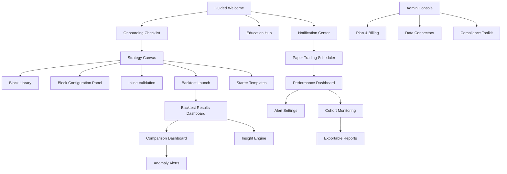
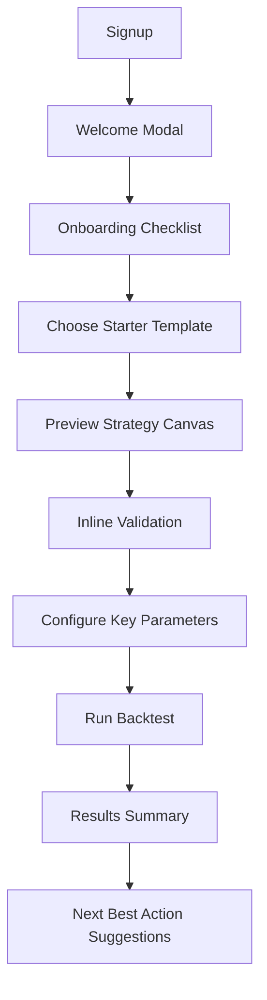
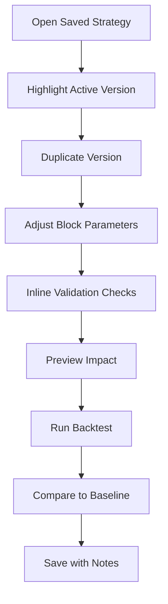
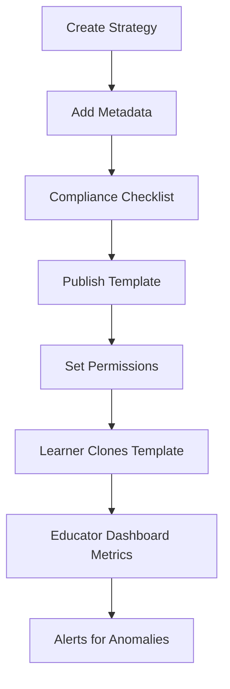
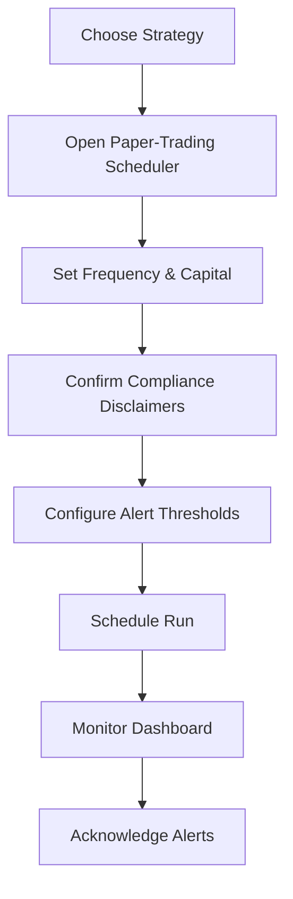
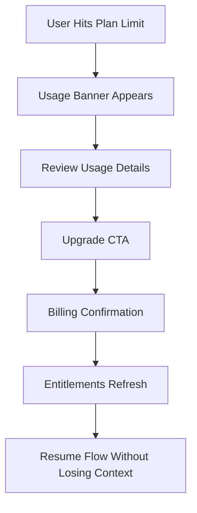

# Blockbuilders UI/UX Specification

## Introduction
This document defines the user experience goals, information architecture, user flows, and visual design specifications for Blockbuilders's user interface. It serves as the foundation for visual design and frontend development, ensuring a cohesive and user-centered experience.

## Overall UX Goals & Principles
### Target User Personas
**Retail Crypto Tinkerer (Primary):** Non-coding retail trader seeking systematic workflows; needs guided onboarding, transparent backtests, and frictionless first wins to stay confident.

**Power Tinkerer (Iterative Builder):** Data-savvy hobbyist refining complex indicators; expects fast duplication, deep analytics, and granular control without losing context.

**Crypto Educator & Community Leader (Secondary):** Influencer or cohort facilitator distributing templates; requires governance tooling, attribution, and high-signal monitoring that reinforces trust cues.

### Usability Goals
- ≥65% of new accounts complete onboarding and a first backtest within 15 minutes through guided checklists and starter templates.
- Strategy canvas interactions reduce validation errors by >50% via inline guidance and pre-flight checks.
- Comparison dashboards surface actionable KPIs and anomaly flags in one glance so builders decide on next steps within 2 minutes.
- Paper-trading scheduler adoption reaches 60% of active builders, with alert acknowledgements tracked inside the notification center.

### Design Principles
1. Progressive guidance – Start simple with templates and tooltips, then reveal depth as confidence grows.
2. Trust through transparency – Visualize data lineage, assumptions, and compliance messaging alongside results.
3. Confident lab aesthetic – Blend approachability with professional cues so experimentation feels safe yet credible.
4. Accessible by default – WCAG AA color, motion, and control standards baked into every view.
5. Continuous feedback loops – Every action (drag, validate, run) responds instantly with status and next-best steps.

### Change Log
| Date | Version | Description | Author |
| 2025-09-23 | v0.3 | Added asset optimization strategy, bundling guidance, and Storybook handoff workflow | Sally (UX Expert) |
| 2025-09-21 | v0.2 | Synced with PRD v1.4: added paper-trading flows, plan guardrails, mobile read-only guidance, and compliance components | Sally (UX Expert) |
| 2025-09-20 | v0.1 | Initial UI/UX spec draft | Sally (UX Expert) |

## Information Architecture (IA)
### Site Map / Screen Inventory

### Navigation Structure
**Primary Navigation:** Strategic funnel from "Build" (canvas, templates) to "Validate" (backtests, paper trading) to "Compare" (dashboards) to "Manage" (community and admin tools).

**Secondary Navigation:** Contextual tabs for strategy versions, result breakdowns, and educator cohorts; persistent access to notifications and education center.

**Breadcrumb Strategy:** Display within admin operations and educator consoles to clarify depth (e.g., Admin Console > Compliance Toolkit > Disclosures).

## User Flows
### Flow: Onboard to First Backtest
- Goal: Lead first-time users from signup to successful backtest within 15 minutes.
- Diagram:

- Edge Cases: Missing data connectors prompts; validation errors require inline guidance; free-tier limit messaging appears before run.
- Success Metrics: Backtest completion rate, time to backtest, checklist completion.

### Flow: Iterating on Strategy Blocks
- Goal: Empower power users to tweak indicators and logic quickly.
- Diagram:

- Edge Cases: Validation fails; backtest quota exceeded; version naming conflicts.
- Success Metrics: Time to iteration, reduction in validation errors, usage of comparison hub.

### Flow: Community Template Sharing
- Goal: Allow educators to publish templates with compliance checks and analytics.
- Diagram:

- Edge Cases: Pending compliance review, takedown requests, learner over quota, flagged disclosures requiring edits.
- Success Metrics: Template adoption rate, compliance approval time, cohort engagement, trust incident resolution time.

### Flow: Schedule Paper Trading & Alerts
- Goal: Let builders schedule strategies, monitor live-like performance, and respond to anomalies.
- Diagram:

- Edge Cases: Quota limits triggering upgrade CTAs, stale market data warnings, missed runs requiring retries, acknowledgement SLAs expiring.
- Success Metrics: Paper-trade adoption (≥60%), alert acknowledgement time, number of retries due to data freshness issues.

### Flow: Plan Limits & Upgrades
- Goal: Enforce freemium quotas while providing a seamless upgrade path.
- Diagram:

- Edge Cases: Payment failure, entitlement sync delays, users declining upgrade, multi-tab state drift.
- Success Metrics: Conversion rate from limit prompts, time to entitlement activation, support tickets related to plan gating.

## Component Inventory
### Strategy Canvas Components
- Canvas Grid
- Block Nodes (Data Source, Indicator, Signal Logic, Risk Control, Execution)
- Connectors with Validation Badges
- Version Switcher
- Inline Tooltips

### Configuration Components
- Side Panel Form with Tabs (Parameters, Data Assumptions, Risk Controls)
- Live Preview
- Validation Summary

### Results & Insights Components
- KPI Summary Cards
- Equity Curve Charts
- Trade Log Tables
- Anomaly Flags
- Insight Recommendations
- Comparison Matrix

### Notifications & Monitoring Components
- Notification Center with Filters
- Scheduler Wizard
- Alert Threshold Builder & Acknowledgement Workflow
- Compliance & Disclosures Banner
- Cohort Performance Cards

### Compliance & Trust Components
- Disclosure snippets manager with contextual placement (onboarding, canvas, exports).
- Risk review queue indicator for flagged templates.
- Trust & Safety dashboard tiles summarizing incidents, resolutions, and policy updates.
- Export watermarking and disclaimer controls supporting Story 4.3 requirements.

## Visual Language
### Color Palette
- Primary: Midnight blue (#14213d) for lab-like trust.
- Secondary: Electric teal (#00c6b8) for interactive highlights.
- Accent: Solar yellow (#fca311) for status cues.
- Neutrals: Slate gray scale (#1f2933 to #e4e7eb) to keep focus on data.
- Alerts: Success #2dd881, Warning #ffb703, Error #ef233c.

### Typography
| Type Token | Font Size | Weight | Line Height |
| --- | --- | --- | --- |
| H1 | 36px | 600 | 44px |
| H2 | 28px | 600 | 36px |
| H3 | 22px | 500 | 32px |
| Body | 16px | 400 | 24px |
| Small | 14px | 400 | 20px |

### Iconography
**Icon Library:** Phosphor Icons set for consistent, rounded geometry.

**Usage Guidelines:** Pair icons with labels for clarity; stick to outlined style at 20px baseline, fill only for alerts; ensure accessible contrast.

### Spacing & Layout
**Grid System:** 12-column responsive grid with 24px gutters (desktop), 16px (tablet), 8px (mobile).

**Spacing Scale:** 4-8-12-16-24-32-48px increments; use 12px multiples for canvas connections; maintain 32px breathing room around charts.

## Accessibility Requirements
**Standard:** WCAG 2.1 AA

**Visual:**
- Color contrast ratios: Minimum 4.5:1 for text, 3:1 for graphical components.
- Focus indicators: 2px high-contrast outline with offset.
- Text sizing: Support browser zoom to 200% without loss of content.

**Interaction:**
- Keyboard navigation: Full keyboard traversal across canvas, with shortcuts for block selection.
- Screen reader support: Aria labels for block types, strategy status, and results summaries.
- Touch targets: Minimum 44x44dp for interactive elements.

**Content:**
- Alternative text: Provide descriptive alt text for charts via data summaries.
- Heading structure: Semantic headings for dashboards and modals.
- Form labels: Persistent labels with contextual hints, no placeholder-only forms.

### Testing Strategy
Integrate Axe automated scans, manual keyboard walkthroughs each release, and periodic usability testing with screen reader users.

## Responsiveness Strategy
### Breakpoints
| Breakpoint | Min Width | Max Width | Target Devices |
| --- | --- | --- | --- |
| Mobile | 320px | 599px | iPhone SE+, Pixel (read-only summaries + alerts) |
| Tablet | 600px | 1023px | iPad, Galaxy Tab (light editing, no complex wiring) |
| Desktop | 1024px | 1439px | MacBook Air, Surface |
| Wide | 1440px | - | Pro monitors, ultrawide labs |

**Mobile Constraints:** Hide drag-and-drop canvas editing; surface saved strategy cards, notification feed, and upgrade CTAs with quick actions.

**Tablet Considerations:** Support canvas editing with simplified controls and larger hit targets; defer heavy analytics until users expand detail panes.

### Adaptation Patterns
**Layout Changes:** Collapse side panels into drawers on tablet/mobile; stack dashboards vertically with sticky KPI summaries.

**Navigation Changes:** Hamburger for primary nav on mobile; persistent bottom sheet for run status.

**Content Priority:** Prioritize actionable metrics (KPIs, warnings) over dense charts; mobile surfaces read-only summaries and critical alerts first.

**Interaction Changes:** Canvas interactions limited to desktop and tablet; mobile provides read-only strategy snapshots, alert acknowledgements, and upgrade actions.

## Animation & Micro-interactions
### Motion Principles
Subtle, purposeful motion under 250ms; ease-out curves for entrance, ease-in for exits; reduce motion setting disables non-essential animations.

### Key Animations
- **Block Snap Feedback:** Node snaps into place with 180ms ease-out bounce to confirm connection.
- **Validation Badge Pulse:** Badge gently pulses (120ms) when an error appears; stops after acknowledgement.
- **Backtest Run Progress:** Progress bar transitions with gradient sweep to convey live processing (max 30s).
- **Notification Toast Reveal:** Slide-in from top-right with fade, dismisses in 5s unless hovered.

## Performance Considerations
### Performance Goals
- **Page Load:** Time-to-interactive under 2 seconds on broadband.
- **Interaction Response:** UI actions under 100ms feedback.
- **Animation FPS:** Maintain 60 FPS for canvas and charts.

### Design Strategies
Use skeleton loaders, virtualized lists for logs, defer heavy charts off-screen, and leverage gradient placeholders to communicate loading; prioritize above-the-fold resources.

## Asset Optimization & Component Workflow
### Asset Preparation & Storage
- Maintain source-of-truth artwork and iconography in the Figma "Strategybuilder UI" library; attach component IDs in handoff notes so engineers can cross-link within Storybook docs.
- Export production assets through the shared "Frontend Export" preset (WebP at 80% quality for photography, AVIF for hero imagery, SVG for icons/illustrations). Keep individual raster assets ≤180KB; flag anything larger for engineering review before merge.
- Store optimized assets under `frontend/public/assets/{feature}` using lowercase-kebab-case naming. Automations run `npm run lint` in CI, so avoid capital letters or spaces to keep paths deterministic.
- For animated elements, prefer CSS transitions or Lottie JSON. Host Lottie files alongside imagery and document target frame rates in the component notes.

### Bundling & Loading Strategy
- Frontend uses Next.js 15 with the default Turbopack dev bundler and `next build` for production. Lean on route-based code splitting from App Router layouts and `loading.tsx` files to keep initial payloads small.
- Budget the `/_next/static/chunks/main` bundle to ≤150KB gzipped and each strategy-specific route to ≤200KB gzipped. Use `npm run build -- --profile` inside `frontend/` to surface bundle analyzer output before handoff.
- Defer heavy charting or data-inspection packages via `next/dynamic` with explicit skeleton states. Only mark modules as "use client" when interactive; keep data formatting on the server to leverage React Server Components.
- Apply `next/image` for all raster assets so Vercel handles format negotiation (WebP/AVIF) and responsive sizing. Icons ship as inline SVG components optimized with SVGO before commit (automation hook tracked in the design ops backlog).

### Storybook & Component Handoff
- Stand up Storybook 8 in `frontend/.storybook` and expose an `npm run storybook` script for local review. Each component story must include `design` annotations pointing back to the Figma frame and Controls for key tokens (spacing, elevation, state).
- Organize stories using the `Flows/`, `Components/`, and `Primitives/` hierarchy that mirrors this spec's component inventory. Provide at least one accessibility-focused story (keyboard interaction or high-contrast mode) for interactive elements.
- When introducing a new UI surface, deliver a paired MDX doc in Storybook that captures usage guidelines, known edge cases, and asset requirements so engineers can implement without referencing Figma.
- Snapshots run via Chromatic in CI; execute the local visual regression command (`npm run test:visual`, once added) before requesting review to ensure no unapproved deltas leave Storybook.

### QA & Release Checklist
- ✅ Figma assets exported with optimization preset and stored under `frontend/public/assets`.
- ✅ Bundle analyzer checked; any route exceeding budget documented with mitigation plan.
- ✅ Storybook stories merged with design annotations, controls, and accessibility coverage.
- ✅ Chromatic/visual regression suite green (or local `npm run test:visual` run attached once the script lands); link evidence in the pull request description.
- ✅ Update this spec's component inventory when new UI primitives land.

## Next Steps
### Immediate Actions
1. Review spec with PM/Engineering for alignment, focusing on new paper-trading, upgrade, and compliance scenarios.
2. Translate flows into Figma wireframes and interactive prototypes, including mobile read-only views and alert acknowledgement pathways.
3. Set up design tokens in codebase aligned to palette/typography; extend tokens for alert thresholds and compliance messaging states.
4. Partner with Compliance to finalize disclosure placements before handoff; schedule accessibility audit once initial implementation is ready.

### Design Handoff Checklist
- [x] All user flows documented
- [x] Component inventory complete
- [x] Accessibility requirements defined
- [x] Responsive strategy clear
- [x] Brand guidelines incorporated
- [x] Performance goals established

## Checklist Results
UI/UX checklist pending; run during design review cadence.
